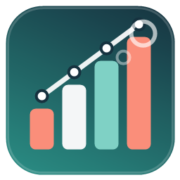

# 02viz — Geospatial Visualization Studio

**Geospatial data visualization studio: multi-engine, interactive, publication-quality charts from QGIS layers and external data.**

<!-- hero: docs/hero.png lands with the first feature release -->

---

## Why 02viz?

Charting in GIS has always meant exporting attribute tables to a spreadsheet, or wrestling with one fixed plotting library. 02viz puts a full visualization studio inside QGIS: pick a layer (or any external table), pick a chart, pick an engine — and get an interactive, publication-quality graphic that stays linked to the map canvas. It is built for planners, analysts and cartographers who want their charts to match the quality of their maps.

## ✨ Features

- **One-click Explore** — pick a layer, press one button: 02viz profiles every field and builds a complete interactive dashboard — KPI cards, a chart per field, a Pearson correlation matrix, the strongest-relationship scatter with trend line, and plain-English insight chips ("Strongest link: pop ↔ income, r = -0.47").
- **Eleven chart types, zero setup** — bar (grouped/stacked), line, area, scatter, bubble, histogram, pie/donut, box plot, heatmap, treemap and sunburst.
- **Two rendering engines** — vendored Apache ECharts and Plotly.js behind one spec contract; switch engines with a combo box, everything works offline.
- **Chart → map selection** — click a bar, slice or point and the matching features are selected on the canvas (QtWebKit and QtWebEngine bridges).
- **Live mode** — optionally re-render on every canvas selection change; "Only selected features" scopes any chart to your selection.
- **Built-in data shaping** — aggregation (count/sum/mean/median/min/max), group/color-by field, Top-N with "Other" collapse, value sorting, least-squares trend line, histogram binning and box-plot quartiles — all pure Python, no pandas/numpy needed.
- **Layers and beyond** — chart any vector layer or attribute table, or load external CSV/XLSX/ODS tables straight into the studio.
- **Four themes** — Studio Light, Ink Dark, Soft Pastel, Bold Print; consistent across both engines.
- **One-file export** — every chart saves as a single self-contained interactive HTML; PNG export via the chart toolbox.
- **Qt5 and Qt6 ready** — runs on QGIS 3.28+ and the QGIS 4 line, with a WebEngine → WebKit → browser viewer fallback chain.

## 🚀 Installation

**From the QGIS Plugin Hub (recommended):** `Plugins → Manage and Install Plugins…` → search for **"02viz"** → *Install*.

**From a release zip:** download the latest zip from [Releases](https://github.com/YusufEminoglu/02viz/releases) → `Plugins → Install from ZIP`.

Requires QGIS 3.28 or newer. No external Python dependencies for the core studio.

## 📖 Quick start

1. Install 02viz and click the **02viz Studio** toolbar button — the studio dock opens on the right.
2. Pick a layer (or **Load external table…** for a CSV/XLSX), optionally tick *Only selected features*.
3. Choose a chart type, set the X/Y fields and an aggregation if you want grouping.
4. Hit **Render chart** — the interactive chart appears right in the dock.
5. **Export HTML…** saves it as a single self-contained file; the chart toolbox saves PNG.

## ⚙️ Reference

| Group | Component | What it does |
|-------|-----------|--------------|
| Data | Layer combo + selected-only | Binds any vector layer/table; respects canvas selection |
| Data | Live: redraw on selection | Re-renders the chart whenever the layer selection changes |
| Data | Load external table… | Opens CSV/XLSX/ODS/GPKG tables via OGR and adds them to the layer list |
| Chart | Type / Engine / Theme | 11 chart types × 2 engines (ECharts, Plotly) × 4 themes |
| Chart | X / Y / Group / Value-Size | Field bindings; Group splits colored series, Value drives bubble size, heatmap cells and treemap weights |
| Chart | Aggregate / Bins / Top N / Sort | count·sum·mean·median·min·max, histogram bins, Top-N with "Other", value sorting |
| Chart | Stacked / Trend line / Click selects | Stack bars+areas, least-squares trend, chart→map selection toggle |
| Output | Render chart | Renders interactive HTML in the embedded viewer (WebEngine → WebKit → browser) |
| Output | ✨ Explore layer | One click → full dashboard: KPIs, auto-charts, correlation matrix, insights |
| Output | Export HTML… | Saves the chart **or the whole dashboard** as one self-contained offline HTML file |

## 🧩 Part of the PlanX ecosystem

02viz is one of 16 open-source QGIS plugins for urban planning by the same author:

| Planning & analysis | CAD & production | 3D & visualization |
|---|---|---|
| [PlanX](https://github.com/YusufEminoglu/PlanX) — spatial-planning suite | [PlanX CAD Toolset](https://github.com/YusufEminoglu/PlanX-CAD) — drafting-grade CAD | [PlanX 3D City](https://github.com/YusufEminoglu/planx_3d_city) — Three.js city viewer |
| [GeoStats Lab](https://github.com/YusufEminoglu/planx_geostats) — spatial statistics | [EasyFillet](https://github.com/YusufEminoglu/EasyFillet) — tangent-arc fillet | [3D OSM Model](https://github.com/YusufEminoglu/osm_3d_model) — OSM → 3D city in browser |
| [Suitability Lab](https://github.com/YusufEminoglu/planx_suitability_lab) — raster MCDA | [Settlement Toolset](https://github.com/YusufEminoglu/PlanX-Settlement) — 9-stage settlement plans | [OSM Quick 3D](https://github.com/YusufEminoglu/osm_quick_3d) — OSM → native QGIS 3D |
| [DataCube Lab](https://github.com/YusufEminoglu/planx_datacube) — spatiotemporal cubes | [UIP Toolset](https://github.com/YusufEminoglu/PlanX-UIP) — Turkish master-plan automation | [Urban Procedural 3D](https://github.com/YusufEminoglu/planx_urban_procedural_3d) — parametric zoning lab |
| [Urban Resilience](https://github.com/YusufEminoglu/planx_urban_resilience) — 28 resilience tools | [ParcelFlux](https://github.com/YusufEminoglu/parcelflux) — parcel subdivision | [CartoLab](https://github.com/YusufEminoglu/planx_cartolab) — publication cartography |

## 📜 License & author

GPL-3.0 © [Yusuf Eminoğlu](https://github.com/YusufEminoglu) — bug reports and feature requests welcome in [Issues](https://github.com/YusufEminoglu/02viz/issues).
