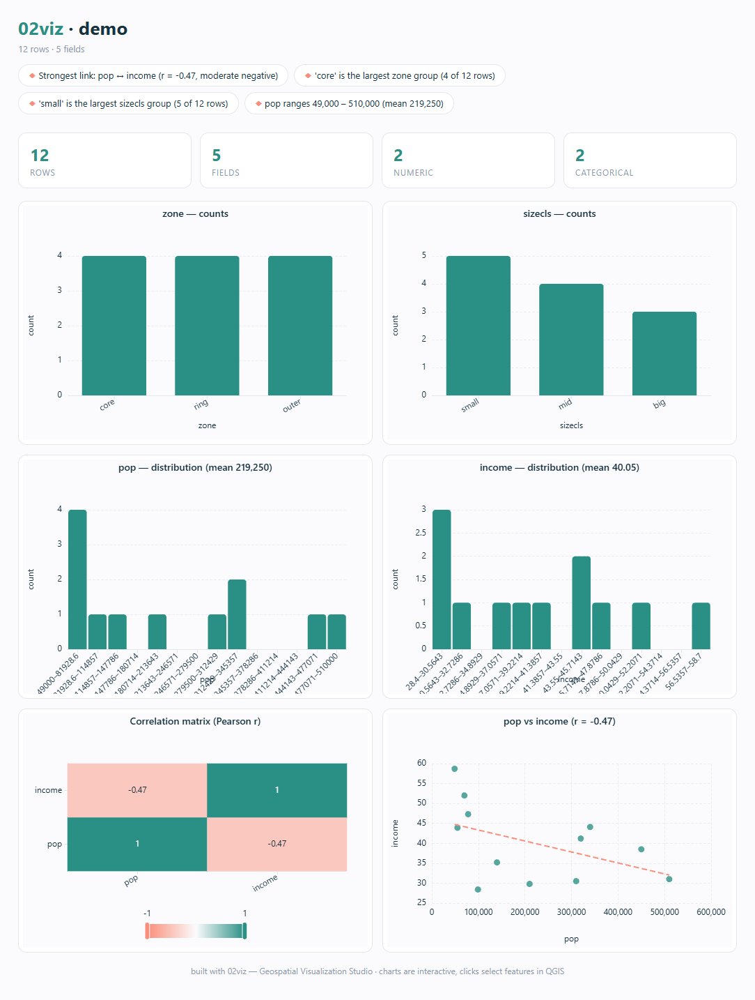
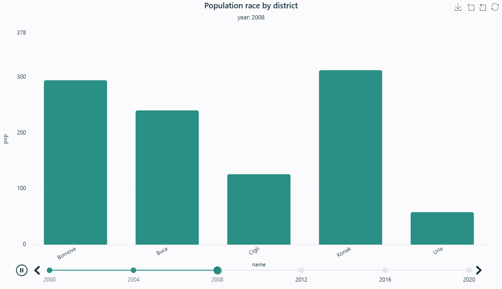
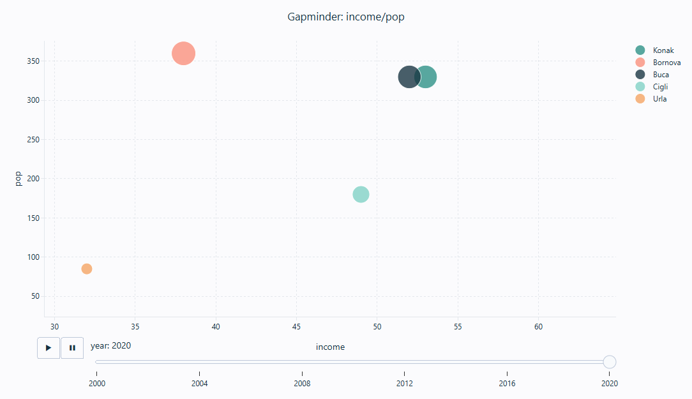
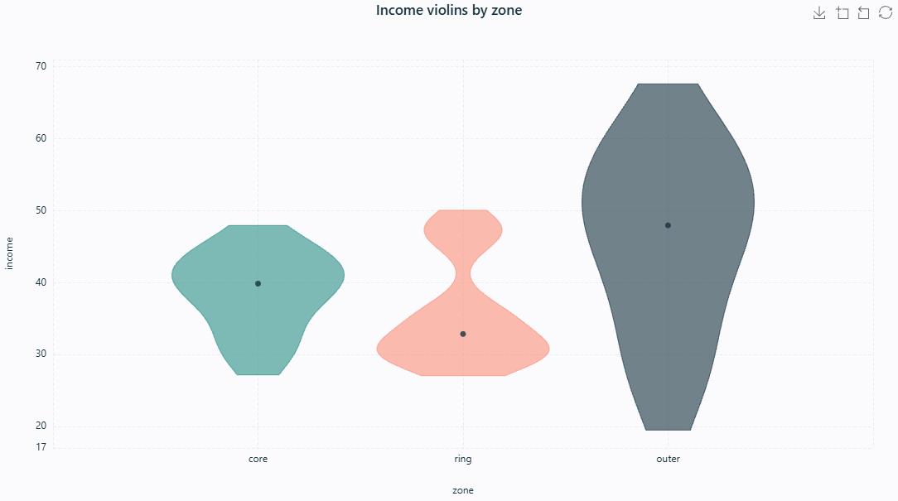
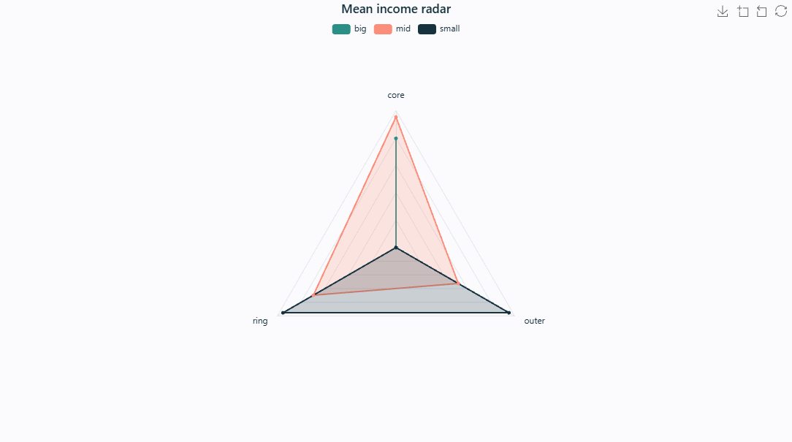
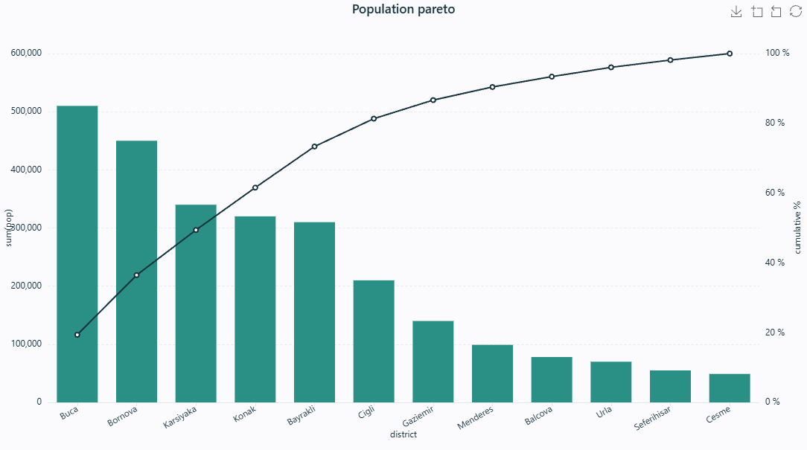
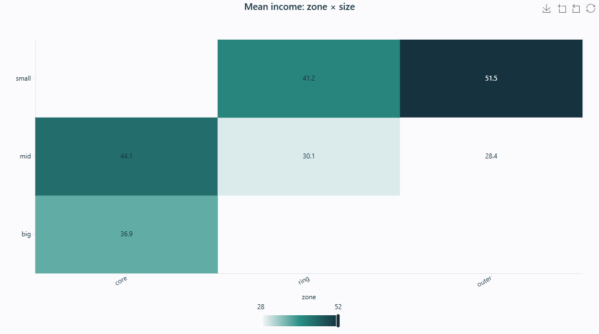
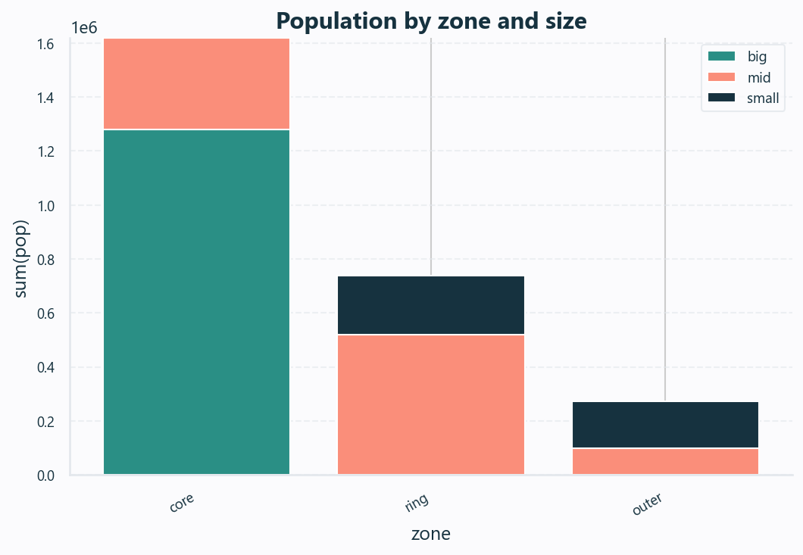

# 02viz — Geospatial Visualization Studio

**Geospatial data visualization studio: multi-engine, interactive, publication-quality charts from QGIS layers and external data.**

---

## Why 02viz?

**Zero2Visual — from zero to elegant visuals, fast.** Charting in GIS has always meant exporting attribute tables to a spreadsheet, or wrestling with one fixed plotting library. 02viz puts a full visualization studio inside QGIS, organised as **one dock with three tabs — Charts, Map diagrams and Labels** — three ways to turn a layer's data into a publication-quality visual that stays linked to the map. It is built for planners, analysts and cartographers who want their visuals to match the quality of their maps.

## ✨ Features

- **One dock, three tabs** — **Charts** (interactive web charts), **Map diagrams** (native diagrams on every feature) and **Labels** (quick elegant labels), all sharing one layer selector.
- **One-click Explore** — pick a layer, press one button: 02viz profiles every field and builds a complete interactive dashboard — KPI cards (with overall **completeness**), a collapsible **field-summary table** (type · missing % · distinct · range/top), a chart per field, a **normalised box plot** putting every numeric field on one comparable 0–1 axis, a Pearson correlation matrix, the strongest-relationship scatter with trend line, and plain-English insight chips — dominant category, range, **skew with a log-transform hint**, **outliers**, near-constant and mostly-empty fields, notable correlations. Identifier columns (fid/id/gid/uuid) are skipped.
- **Built-in guide + smart suggestions, fully offline** — a **❔ Guide** button opens a designed, self-contained HTML user guide (every feature, the normalisation modes, copy-ready label-expression recipes, and prompts for an external AI assistant), and a **💡 Suggest** button reads the active layer's fields to configure and render the most insightful chart for you — telling you *why*. No account, no internet, no new dependencies.
- **Seventeen chart types, zero setup** — bar (grouped/stacked), line, area, scatter, bubble, histogram, pie/donut, box plot, heatmap, treemap, sunburst, mean ± σ band, mean ± σ bars, density (KDE), violin, radar/spider and Pareto (80/20).
- **Animated charts — a play axis** — pick a time or sequence field and any **bar, line, area, scatter, bubble or pie** chart plays through it: a **bar-chart race**, **Gapminder-style bubbles**, composition or trends unfolding over the years. An auto-play timeline (ECharts) or a slider with play/pause (Plotly), with categories, colours and axes held steady across frames so things animate *in place* — and animated bars/points still click to select features on the map. Pure Python, fully offline, and the animation exports in the one-file HTML.
- **Four engines, engine-first** — pick the renderer, then choose from the chart types it can draw; the rest grey out. Three are vendored and fully offline (Apache ECharts, Plotly.js, Vega-Lite); the optional **matplotlib / seaborn** engine renders publication-grade *static* figures and installs on demand (auto-detected, one-click pip install — the core studio stays dependency-free).
- **Map diagrams on the canvas, with normalisation** — native QGIS **pie / bar / stacked-bar / text** diagrams on every feature, sized in millimetres and coloured with the studio palette. Optionally **normalise** the fields — **Min–max (0–1)**, **Z-score** or **Log** — so a pie or bar compares fields on very different scales fairly instead of one big-number field swamping the rest (min/max/mean/std are computed from the features and baked into the diagram expressions — nothing is written to your data). They print and export to layout like any symbology.
- **Expression-driven labels** — turn fields into well-placed labels with a preset (clean subtle-halo / strong halo / bold / plain) and **format them without leaving the dock**: round numbers, thousands separators, a prefix/suffix or units, change case, word-wrap, stack a **second field on its own line**, or type **any QGIS expression** — with a live preview and a first-feature sample. Built on native QGIS labeling.
- **Publication-grade output** — one type system, soft dashed gridlines, clean card tooltips, rounded bars and minimal axes across every engine — charts read at Tableau quality.
- **Chart → map selection** — click a bar, slice or point and the matching features are selected on the canvas, on every QGIS web stack (crash-safe title transport, no QWebChannel needed).
- **Map → chart cross-filter** — select features on the canvas and the chart instantly dims everything else, no re-render; works in single charts and across every dashboard tile.
- **Live mode** — optionally re-render on every canvas selection change; "Only selected features" scopes any chart to your selection.
- **Built-in data shaping & statistics** — aggregation (count/sum/mean/median/min/max), group/color-by field, Top-N with "Other" collapse, value sorting, least-squares trend line, histogram binning, box-plot quartiles, sample standard deviation, Silverman-bandwidth Gaussian KDE and cumulative shares — all pure Python, no pandas/numpy needed.
- **Layers and beyond** — chart any vector layer or attribute table, or load external CSV/XLSX/ODS tables straight into the studio.
- **Four themes, eight palettes + an embedded swatch editor** — Studio Light, Ink Dark, Soft Pastel and Bold Print themes, a Colors selector with 8 curated palettes (Vivid, Colorblind safe, Viridis, Sunset, Ocean, Earth, Berry, Grayscale print), and **inline swatches right in the dock** — click one to recolour it, `+`/`−` to resize the palette. All override the theme palette identically in every engine.
- **One-file export** — every chart saves as a single self-contained interactive HTML; PNG export via the chart toolbox.
- **Qt5 and Qt6 ready** — runs on QGIS 3.28+ and the QGIS 4 line, with a WebEngine → WebKit → browser viewer fallback chain.

## 🖼️ Gallery

**Animated charts — a play axis.** Pick a year (or any sequence) field and the chart plays through it, with axes and colours held steady so categories animate in place:

| Bar-chart race (ECharts timeline) | Gapminder bubbles (Plotly slider) |
|:---:|:---:|
|  |  |

A few of the seventeen chart types, rendered offline by the vendored JS engines and styled for publication:

| Violin (KDE) | Radar / spider |
|:---:|:---:|
|  |  |
| **Pareto (80/20)** | **Correlation heatmap** |
|  |  |

The optional **matplotlib / seaborn** engine renders the same spec as a publication-grade static figure:

## 🚀 Installation

**From the QGIS Plugin Hub (recommended):** `Plugins → Manage and Install Plugins…` → search for **"02viz"** → *Install*.

**From a release zip:** download the latest zip from [Releases](https://github.com/YusufEminoglu/zero2viz/releases) → `Plugins → Install from ZIP`.

Requires QGIS 3.28 or newer. **No external Python dependencies for the core studio** (the three JS engines are vendored). The optional matplotlib/seaborn engine installs on demand, with your consent, from inside the plugin.

## 📖 Quick start

1. Install 02viz and click the **02viz Studio** toolbar button — the studio dock opens on the right.
2. Pick a layer (or **Load external table…** for a CSV/XLSX), optionally tick *Only selected features*.
3. On the **Charts** tab pick the engine and chart type, set the X/Y fields and an aggregation if you want grouping — or press **💡 Suggest** to let 02viz configure the best chart for your fields.
4. Hit **Render chart** — the interactive chart appears right in the dock.
5. **Export HTML…** saves it as a single self-contained file; the chart toolbox saves PNG. The **Map diagrams** (with Min–max / Z-score / Log normalisation) and **Labels** (round / multi-line / expressions) tabs draw straight onto the canvas. New to it all? Open **❔ Guide**.

## ⚙️ Reference

| Group | Component | What it does |
|-------|-----------|--------------|
| Data (shared) | Layer combo + selected-only | Binds any vector layer/table; respects canvas selection |
| Data (shared) | Live: redraw on selection | Re-renders the chart whenever the layer selection changes |
| Data (shared) | Load external table… | Opens CSV/XLSX/ODS/GPKG tables via OGR and adds them to the layer list |
| Charts | Engine / Type / Theme / Colors | 4 engines (ECharts, Plotly, Vega-Lite + optional matplotlib) × 17 types × 4 themes × 8 palettes + inline custom swatches |
| Charts | X / Y / Group / Value-Size / Title | Field bindings + a chart-title override; Group splits colored series, Value drives bubble size, heatmap cells and treemap weights |
| Charts | Animate by ▶ / Play speed | Play a bar/line/area/scatter/bubble/pie chart through a time or sequence field — bar-chart race, Gapminder bubbles, composition over years (ECharts timeline / Plotly slider) |
| Charts | Aggregate / Bins / Top N / Sort | count·sum·mean·median·min·max, histogram bins, Top-N with "Other", value sorting |
| Charts | Render / 💡 Suggest / ✨ Explore / Export / ↗ | Render to the embedded viewer (WebEngine → WebKit → browser), one-click chart suggestion, one-click Explore dashboard, one-file HTML export, open-in-browser fallback |
| Header | ❔ Guide | Full offline user guide with per-layer suggestions and copy-ready expression/AI-prompt recipes |
| Map diagrams | Type / Fields / Size / **Normalize** | Native QGIS pie/bar/stacked/text diagrams on every feature; Normalize = None / Min–max (0–1) / Z-score / Log makes differently-scaled fields comparable |
| Labels | Field / Second line / Decimals / Thousands / Prefix-Suffix / Case / Wrap / Expression / Style / Size | Formatted, multi-line, expression-driven labels via native QGIS labeling, with a live preview |

## 🧩 Part of the PlanX ecosystem

02viz is one of 16 open-source QGIS plugins for urban planning by the same author:

| Planning & analysis | CAD & production | 3D & visualization |
|---|---|---|
| [PlanX](https://github.com/YusufEminoglu/PlanX) — spatial-planning suite | [PlanX CAD Toolset](https://github.com/YusufEminoglu/PlanX-CAD) — drafting-grade CAD | [PlanX 3D City](https://github.com/YusufEminoglu/planx_3d_city) — Three.js city viewer |
| [GeoStats Lab](https://github.com/YusufEminoglu/planx_geostats) — spatial statistics | [EasyFillet](https://github.com/YusufEminoglu/EasyFillet) — tangent-arc fillet | [3D OSM Model](https://github.com/YusufEminoglu/osm_3d_model) — OSM → 3D city in browser |
| [Suitability Lab](https://github.com/YusufEminoglu/planx_suitability_lab) — raster MCDA | [Settlement Toolset](https://github.com/YusufEminoglu/PlanX-Settlement) — 9-stage settlement plans | [OSM Quick 3D](https://github.com/YusufEminoglu/osm_quick_3d) — OSM → native QGIS 3D |
| [DataCube Lab](https://github.com/YusufEminoglu/planx_datacube) — spatiotemporal cubes | [UIP Toolset](https://github.com/YusufEminoglu/PlanX-UIP) — Turkish master-plan automation | [Urban Procedural 3D](https://github.com/YusufEminoglu/planx_urban_procedural_3d) — parametric zoning lab |
| [Urban Resilience](https://github.com/YusufEminoglu/planx_urban_resilience) — 28 resilience tools | [ParcelFlux](https://github.com/YusufEminoglu/parcelflux) — parcel subdivision | [CartoLab](https://github.com/YusufEminoglu/planx_cartolab) — publication cartography |

## 📜 License & author

GPL-3.0 © [Yusuf Eminoğlu](https://github.com/YusufEminoglu) — bug reports and feature requests welcome in [Issues](https://github.com/YusufEminoglu/zero2viz/issues).
